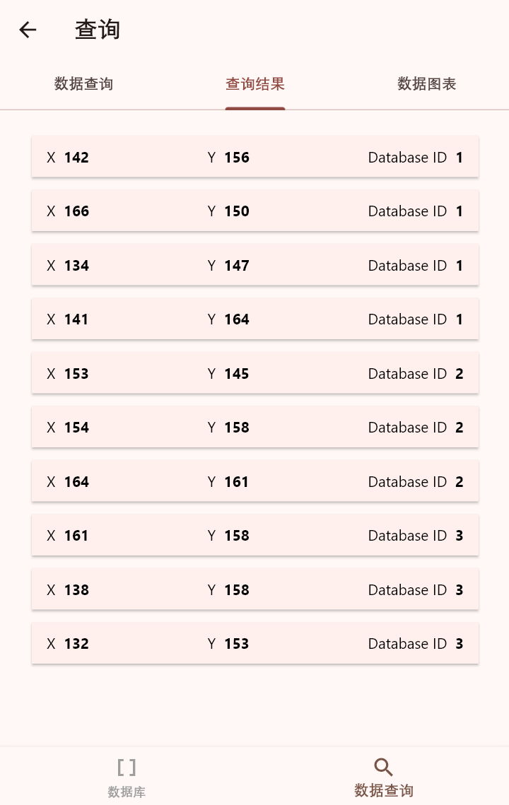
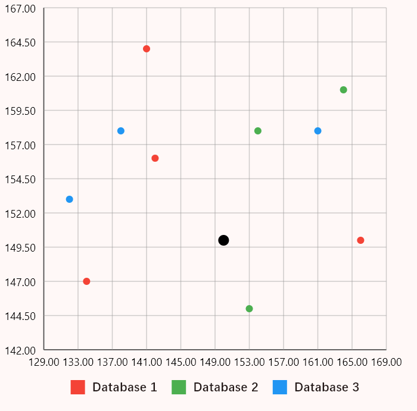

# FederatedDataBase

## 项目简介

科研课堂的大作业,是一个基于gRPC通信实现的具有一定加密功能的联邦数据库

可以对指定数据进行最近邻查询(NearestQuery),反向最近邻查询(AntiNearestQuery),加密最近邻查询(EncryptedNearestQuery)

## 项目结构

### 前端
基于`Flutter`框架进行搭建, 采用Dart语言配置gRPC与后端进行通信

详情请见前端仓库[FederatedDatabase-Flutter](https://github.com/TTclubRmat/FederatedDatabase-Flutter)

前后端通信定义的消息见`federation.proto`

目前前端支持将查询结果渲染为动态散点图

### 后端

后端要求实现`FederationServer.py`,`DatabaseServer.py`两个程序

分别实现**联邦数据库的服务端**以及每个独立的**数据库本体**

客户端使用`gRPC`服务发送查询的数据请求,服务端接收后发送查询操作给服务端管控下的数据库,

在此过程中可选择使用同态加密算法,由此防止因泄露数据过多导致的安全性降低

服务端最后再将结果返回给客户

## 项目依赖

### 前端

需要配置`Dart`和`Flutter`的SDK以配置前端的开发环境

为了方便我们在文件夹中提供了windows系统的.exe安装包

可以直接下载安装无需从源码层面编译

编译命令
```shell
flutter build windows
```

### 后端

运行前安装`grpcio`,`tenseal`等软件包进行开发
```shell
pip install grpcio grpcio-tools tenseal numpy
```

## 项目运行

运行`DatabaseServer.py`,`FederationQuery.py`启动服务端
```shell
python DatabaseServer.py FederationQuery.py
```

### 控制台输出

运行`FederationTest.py`
```shell
python FederationTest.py
```
`FederationTest.py`提供了三种查询的样例,若直接运行会有以下输出

```string
Query Type: Nearest, X:150, Y:150, QueryNum:10
User at (142, 156) from Database 1
User at (166, 150) from Database 1
User at (134, 147) from Database 1
User at (141, 164) from Database 1
User at (153, 145) from Database 2
User at (154, 158) from Database 2
User at (164, 161) from Database 2
User at (161, 158) from Database 3
User at (138, 158) from Database 3
User at (132, 153) from Database 3
程序运行时间: 0.021190 秒
Query Type: AntiNearest, X:150, Y:50
User at (145, 49) from Database 1
程序运行时间: 1.547219 秒
Query Type: EncryptedNearest, X:150, Y:150, QueryNum:10
User at (142, 156) from Database 1
User at (166, 150) from Database 1
User at (134, 147) from Database 1
User at (141, 164) from Database 1
User at (153, 145) from Database 2
User at (154, 158) from Database 2
User at (164, 161) from Database 2
User at (161, 158) from Database 3
User at (138, 158) from Database 3
User at (132, 153) from Database 3
程序运行时间: 21.325934 秒
```
PS:运行时间会略有不同

### 前端输出

这里更推荐使用配套的前端程序进行查询

查询界面


查询结果



数据图表

